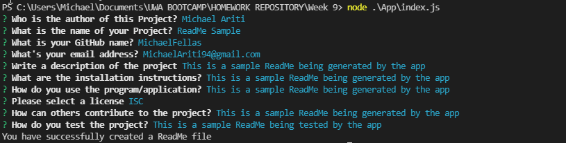

# Michael Ariti - ReadMe Generator

[](https://opensource.org/licenses/MIT)

|  Table of Contents |
| ----------- |
| [1. Description.](#description)|
| [2. User Story.](#user-story) |
| [3. Acceptance Criteria.](#acceptance-criteria) |
| [4. Installation.](#installation) |
| [5. Usage.](#usage)|
| [6. License.](#licenses)|
| [7. Contributing.](#contributing)|
| [8. Tests.](#tests)|
| [9. Technologies Used.](#technologies-used)|
| [10. Screenshot.](#screenshot)|
| [11. Video Demo.](#video-demo)|
| [12. Example ReadMe.](#example-readme)|
| [13. Questions.](#questions)|

## Description

The purpose of this repository is to create a javascript app that runs in node which will generate a professional and polished ReadMe.md based on the users answers to several questions about the project.

## User Story

```md
AS A developer
I WANT a README generator
SO THAT I can quickly create a professional README for a new project
```
## Acceptance Criteria

```md
GIVEN a command-line application that accepts user input
WHEN I am prompted for information about my application repository
THEN a high-quality, professional README.md is generated with the title of my project and sections entitled Description, Table of Contents, Installation, Usage, License, Contributing, Tests, and Questions
WHEN I enter my project title
THEN this is displayed as the title of the README
WHEN I enter a description, installation instructions, usage information, contribution guidelines, and test instructions
THEN this information is added to the sections of the README entitled Description, Installation, Usage, Contributing, and Tests
WHEN I choose a license for my application from a list of options
THEN a badge for that license is added near the top of the README and a notice is added to the section of the README entitled License that explains which license the application is covered under
WHEN I enter my GitHub username
THEN this is added to the section of the README entitled Questions, with a link to my GitHub profile
WHEN I enter my email address
THEN this is added to the section of the README entitled Questions, with instructions on how to reach me with additional questions
WHEN I click on the links in the Table of Contents
THEN I am taken to the corresponding section of the README
```

## Installation

To install this app simply run the command 'npm install inquirer' in the terminal after pulling the github repository.

## Usage

To use this app open the terminal and run the command 'node .\App\index.js'.

## License

This project uses the MIT license.

## Contributing

If you would like to contribute to the project please message my github.

## Tests

This project was tested in VCS terminal using the node function with many trials, especially for the licenses section. 

## Technologies Used

1. Javascript
2. Node.js

## Screenshot


## Video Demo
[Video-Demo](https://drive.google.com/file/d/1fXK-VDeBRJU5O3xvDo14Egqts1sfGjNf/view?usp=sharing)

## Example ReadMe
[Example-ReadMe](./App/Assets/SampleGeneratedReadMe/ReadMe.md)

## Questions

### Email
MichaelAriti94@gmail.com

### End

Michael Ariti 2022